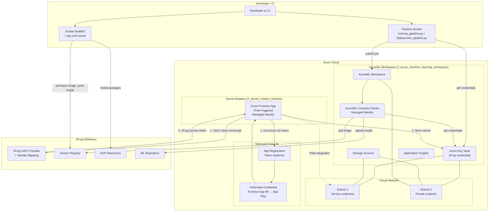

# JFrog + AzureML Integration — Architecture Overview

This document describes the end-to-end architecture of all components in this project: build, training, deployment, and optional automatic secret rotation.

---

## High-Level Component Diagram

---

## Component Summary

| Area | Components | Purpose |
|------|------------|--------|
| **Build** | Developer, Docker BuildKit, Artifactory (Docker, PyPI) | Build training image using Artifactory base image and packages; push image to Artifactory. |
| **AzureML** | AML Workspace, Key Vault, Storage, App Insights, Compute, VNet | Run training/deploy jobs; store JFrog credentials in Key Vault; compute uses Managed Identity to read secrets and pull images. |
| **Secret rotation** | Function App (timer), Entra App Registration, Federated Credential, JFrog OIDC | Function App gets Azure AD token via federated credential, exchanges it with Artifactory OIDC for a JFrog token, writes it to Key Vault. |
| **JFrog** | OIDC provider, Docker registry, PyPI, ML repo | Identity (OIDC), container images, Python packages, ML model artifacts. |

---

## Data Flows

### 1. Build phase
- Developer runs Docker build with `pip.conf` as a secret.
- Build pulls base image and Python packages from Artifactory, then pushes the built image to Artifactory Docker registry.

### 2. Training phase
- Developer runs pipeline script → script reads JFrog credentials from Key Vault (e.g. `az login`) and submits job to AML.
- AML provisions compute → compute uses **Managed Identity** to read JFrog credentials from workspace Key Vault, pulls training image from Artifactory, runs container, trains model, and (optionally) uploads model to Artifactory ML repo via frogml.

### 3. Deployment / inference phase
- Developer runs deployment pipeline → script gets credentials from Key Vault and submits deploy job to AML.
- Compute pulls deploy image from Artifactory, runs container → container gets credentials from Key Vault (Managed Identity), pulls model from Artifactory ML repo, runs inference.

### 4. Automatic secret rotation (advanced setup)
- **Timer** triggers Azure Function.
- Function App **Managed Identity** obtains an Azure AD token for the **Entra App Registration** (using **Federated Credential** that trusts the Function App’s principal).
- Function calls **JFrog OIDC token exchange** with that Azure AD token; Artifactory validates it via the configured OIDC provider and identity mapping, and returns a JFrog access token.
- Function writes the new token into **Azure Key Vault** (same Key Vault used by AML workspace). Training and deployment flows then use the rotated credential with no manual update.

---

## Terraform Layout

- **`1_azure_machine_learning_workspace/terraform/`** — Resource group, VNet (subnets 1 & 2), Key Vault, Storage, Application Insights, AML workspace (with private endpoint in subnet 2), optional compute.
- **`2_secret_rotation_function/terraform/`** — Function App (Flex Consumption), VNet integration, RBAC so Function App identity has **Key Vault Secrets Officer** on the existing AML workspace Key Vault. References existing Key Vault and Storage (from step 1).

Identity and OIDC (Entra App Registration, Federated Credential, JFrog OIDC provider and identity mapping) are configured outside Terraform via Azure CLI and Artifactory UI/API as described in the main [README](README.md).
