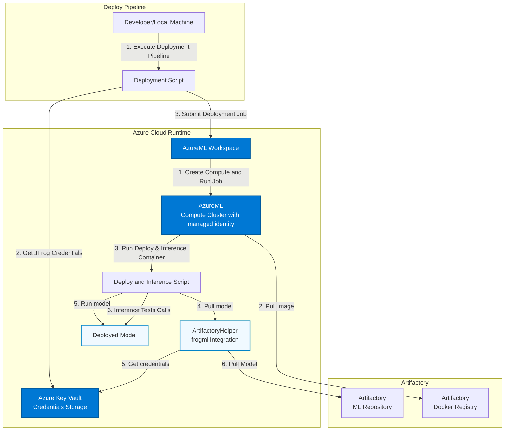
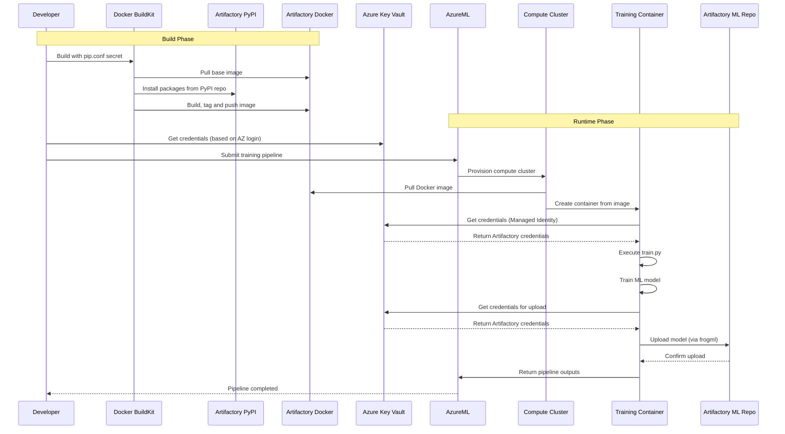
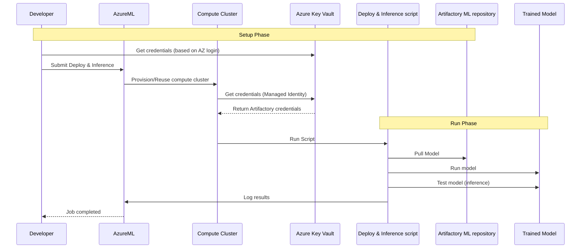

# AzureML + JFrog Artifactory Integration (WIP)

This project demonstrates how to build and run Azure Machine Learning (AzureML) jobs while sourcing packages, images, and model artifacts from/to JFrog Artifactory.
It focuses on secure credential handling, repeatable builds, and predictable promotion of trained models.

What’s inside:
- Opinionated Docker build that pulls base images and Python packages from Artifactory.
- AzureML training pipeline example that runs a sample training script producing a trained Iris model in a managed compute cluster (serverless)
- `frogml` JFrog SDK is used for working with Machine Learning models and datasets packages

## Train Architecture

The following diagram illustrates the complete architecture and data flow of the system:


## Deploy Architecture

The following diagram illustrates the complete architecture and data flow of the deployment example:


### Architecture Components

#### Build Phase
1. **Docker Build Process:**
   - Mounts `pip.conf` as a Docker secret for secure credential handling
   - Uses base image from JFrog Artifactory (e.g. `python:3.13.11-slim` from Artifactory Docker registry)
   - Installs Python packages from Artifactory PyPI repository during build
   - Creates multi-stage Docker image with optimized layers and pushes it to JFrog docker registry
   
   Result: Image is ready for use in AzureML pipelines! 
   
   *At this point, the image will potentially be scanned by JFrog Xray and undergo the customer's SDLC pipeline  
   

#### Train Runtime Phase
1. **Train Pipeline:**
   - A Developer or a CI job runs the Pipeline script 
   - The Pipeline script submits a training job to AzureML workspace
   - The AzureML workspace Creates a compute cluster and runs the training job on it
   - AzureML compute cluster:
        - Retrieves JFrog short lived credentials from AzureML Workspace Key Vault
        - Pulls the training image from Artifactory Docker registry
        - Runs the training image
   - The training container executes the training script (`train.py`)

2. **Model Training & Upload:**
   - Training script trains ML model (e.g. Iris classifier)
   - Model artifacts are generated (model.pkl, metrics.json, metadata.json)
   - `ArtifactoryHelper` class retrieves JFrog short lived credentials from AzureML Workspace Key Vault
   - [optional] Model is uploaded to Artifactory ML Repository using `frogml` package

#### Deployment & Inference Phase
1. **Deployment Pipeline:**
   - A Developer or a CI job runs the deploy_and_inference script 
   - The Pipeline script submits a deployment job to AzureML workspace
   - The AzureML workspace Creates/Uses an existing compute cluster and runs the training job on it (in this example we reuse the existing compute cluster)
   - AzureML compute cluster:
        - Retrieves JFrog short lived credentials from AzureML Workspace Key Vault
        - Pulls the trained model image from Artifactory Docker registry
   - The trained model container:
        -  runs the model
        -  performs inference test calls (``model.predict(...)``)

**Important**: This deployment example is ephemeral, once inference test calls are done, container completes and as min_nodes is set to 0, within few minutes the inference is removed   

#### Authentication & Security
1. **AzureML Workspace's Azure Key Vault:**
   - Stores Artifactory Access Token and Username securely
   - The JFrog short lived Access Token is added and rotated automatically through an Azure function based on OIDC token exchnage protocol. 


2. **Authentication Methods:**
   - **Local Development:** Uses Azure user or application registry credentials (e.g. az login)
   - **AzureML Runtime:** Uses Managed Identity (automatic, no credentials needed) for retrieveing JFrog short lived & auto-rotating token from the AzureML Workspace Key Vault  
   - **Docker Build:** Uses Docker secrets (credentials not stored in image)


### Key Integration Points

#### JFrog Repositories Used
- **Docker Registry:** Stores and serves Docker images, preferably use a virtual docker repository to simplify usage
- **PyPI Remote/Virtual Repository:** Proxies Python packages used by the training scripts
- **ML Repository:** Stores trained ML models with versioning
- **HuggingFace Repository:** Proxies HF packages used by the training script

#### Packages 
- **Docker Images:** Pulled from Artifactory Docker registry during pipeline execution
- **Python Packages:** Installed from Artifactory PyPI repository during Docker build
- **Docker Base Images:** Pulled from Artifactory Docker registry during Docker build
- **Used Models & Datasets:** Pulled from Artifactory using Frogml SDK
- **Resulting Models:** Uploaded to Artifactory ML Repository using Frogml SDK

#### Authentication
- **JFrog Credentials:** Token exchange is based on OIDC

### Sequence Diagram
#### Training
The following sequence diagram shows the temporal flow of operations:


#### Deployment and Infenrece
The following sequence diagram shows the temporal flow of deployment operations:



### Architectual decisions explained

#### Docker Build Process
- **Multi-stage build** This example uses a multi staged docker build for optimized image size.
- **Docker secrets** Using a docker secret for allowing the access into the JFrog private registry allows for a secure credential passing (pip.conf) without the secret leaving traces on the created image.
- **Artifactory base image** Using a base image pulled from the JFrog Docker registry assures security protection for used images i.e. Xray and Curation.
- **Package installation** Python packages are pulled through Artifactory PyPI repository during build for security and control reasons, providing protections against harmfull external dependencies.

#### AzureML Training Pipeline
- **Environment:** Using a Custom Docker image from Artifactory allows for tracability, management and repeatability of the training process along with security protections as described above.
- **Compute:** AzureML compute cluster with Managed Identity allows for passwordless and seameless operation of the training process when working with Azure and with JFrog services.
- **Outputs:** Model files, metrics, and metadata produced by the training process allows deep analytics and understanding of the training process for evaluating the resulting models.

#### Security Model
- **Build Time:** Docker secrets (credentials not in image layers)
- **Runtime:** Azure Key Vault + Managed Identity (no hardcoded secrets)
- **Network:** All communications over HTTPS
- **Access Control:** Role-based access via Azure and Artifactory
- **Used Credentials:** Short lived JFrog Access Token auto-rotated by Azure function. with token rotation based on OIDC and Azure App. registration & Managed Identity


## Quick Start

### Intiliaze Setup Environment (R&R: Azure Administrator)
### Prerequisites
* AzureML Workspace (R&R: Azure Administrator)
* In the Azure Machine Learning workspace Resource add Contributor (TODO add the least privlages to enable working with ws) role to the relevant users or Identities.
### Set Up
* Create Manage Identity and assign it with "Key Vault Secrets User" role for the Workaspace's Key-Vault:
    1. In Azure Managed Identity, create a new managed identity and name it. make sure to choose the AzureML workspace Resource Group and Region
    2. Return to the Azure ML Workspace and inside the overview page drill down to its key vault
    3. inside the Azure ML workspace key vault, open the Access control (IAM)
    4. Add role assignment to role "Key Vault Secrets User" for the managed identity you created above    
    5. Still inside the Workspace Keyvault entity Open > settings > Access Configuration settings and Make sure 'Azure role-based access control (recommended)' is selected

### JFrog Setup (R&R: JFrog Administrator or Project Admin)
### Prerequisites
* JFrog Pypi remote repository
* JFrog Docker Virtual, Local and Remote repositories
* JFrog Machine Learning Repository

### Configure training (R&R: ML Engineer)
### Prerequisites
* Python >= 3.11
* Create pip.conf pointing to you JFrog platform. (See pip.example.conf for referance)
* Azure CLI configured
* Login to Azure account. e.g.`az login --tenant <Tenant id>`, or any othe preferd method.
* Ensure Docker BuildKit is enabled for secret support: `export DOCKER_BUILDKIT=1`

### 1. Set Up Python virtual environment
```bash
cd <project directory>
export PIP_CONFIG_FILE=<pip.conf file you want to use>
source setup_venv.sh
```

### 2. Build, Tag and Push Docker Image
This step builts the training image, you can use the example as-is or replace its training logic on `src/train.py` script.

Build the Docker image with the specified tag. The build uses Docker secrets for secure pip configuration:


```bash
export ARTIFACTORY_HOST=PLACEHOLDER, i.e. <my jfrog platform host> without http schema
export ARTIFACTORY_DOCKER_REPO=PLACEHOLDER i.e. local/virtual repository name
TAG=<DOCKER_TAG>
docker login ${ARTIFACTORY_HOST}

# Use Artifactory base image (if available)
docker build \
  --platform linux/amd64 \
  -t ${ARTIFACTORY_HOST}/${ARTIFACTORY_DOCKER_REPO}/azureml-training:${TAG} \
  -f docker/Dockerfile \
  --secret id=pipconfig,src=${PIP_CONFIG_FILE} \
  --build-arg BASE_IMAGE="${ARTIFACTORY_HOST}/${ARTIFACTORY_DOCKER_REPO}/python:3.13.11-slim" \
  --push \
  .
```

### 3. Run Training Pipeline
This step creats a new training job inside the AzureML workspace and runs it. the job uses the training docker container we built and pushed in the previous steps.

#TODO: Remove the arti user and access and add just the secret name that Aviv is rotate. The user and the token should be included in the same value as in AWS.

Clone config/config.example.yaml into config/config.yaml and update the missing 'PLACEHOLDER' values

Submit the training pipeline to AzureML:

```bash
    python pipeline/training_pipeline.py
```
Once the training pipeline completes you will get a URL for the Azure ML job it created, use that to open the training job and follow its progress.

Deployment (with specific version):
```bash
python pipeline/deployment_pipeline.py --model-name iris-classifier --model-version v20260118123456
```
## Troubleshooting

### Docker Build Issues

- Ensure BuildKit is enabled: `export DOCKER_BUILDKIT=1`
- Verify `pip.conf` exists and contains valid credentials
- Check that Artifactory Docker registry is accessible

### Pipeline Issues

- Verify Azure credentials are correctly set
- Check that the Docker image was successfully pushed to Artifactory
- Ensure Azure Key Vault has the required secrets

## License

See LICENSE file for details.
