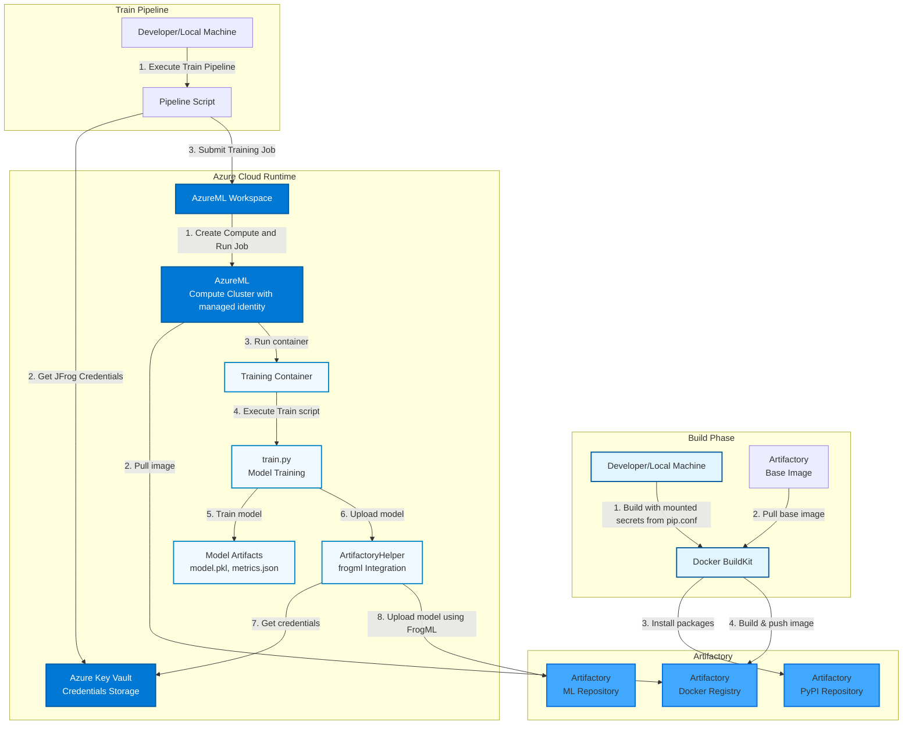
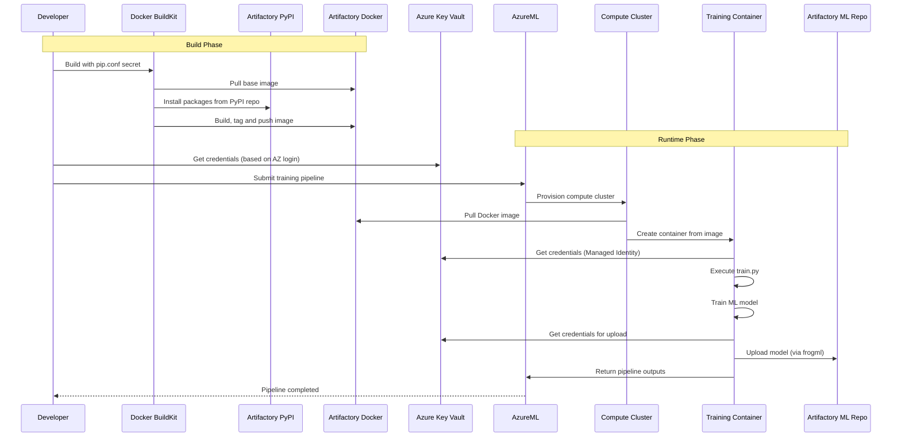
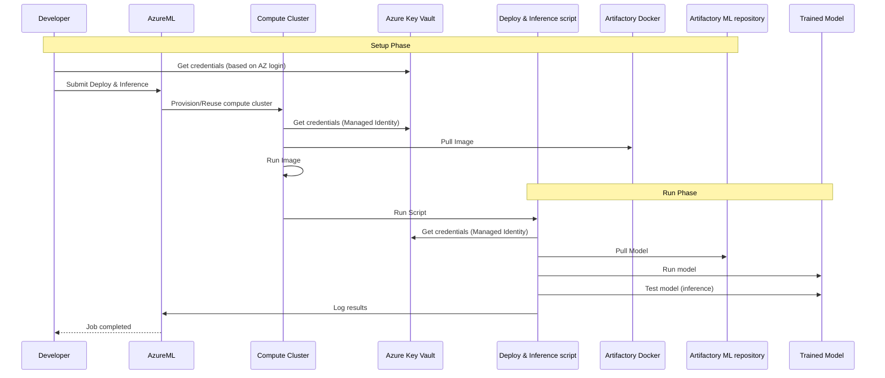

# AzureML + JFrog Artifactory Integration

This project demonstrates how to build and run Azure Machine Learning (AzureML) jobs while sourcing packages, images, and model artifacts from/to JFrog Artifactory.
It focuses on secure credential handling, repeatable builds, and predictable promotion of trained models.

What’s inside:

- Opinionated Docker build that pulls base images and Python packages from Artifactory.
- AzureML training pipeline example that runs a sample training script producing a trained Iris model in a managed compute cluster (serverless)
- `frogml` JFrog SDK is used for working with Machine Learning models and datasets packages

## Train Architecture

The following diagram illustrates the complete architecture and data flow of the system:




## Deploy Architecture

The following diagram illustrates the complete architecture and data flow of the deployment example:


### Architecture Components

#### Build Phase

1. **Docker Build Process:**
  - Mounts `pip.conf` as a Docker secret for secure credential handling
  - Uses base image from JFrog Artifactory (e.g. `python:3.13.11-slim` from Artifactory Docker registry)
  - Installs Python packages from Artifactory PyPI repository during build
  - Creates multi-stage Docker image with optimized layers and pushes it to JFrog docker registry
   Result: Image is ready for use in AzureML pipelines! 
   *At this point, the image will potentially be scanned by JFrog Xray and undergo the customer's SDLC pipeline

#### Train Runtime Phase

1. **Train Pipeline:**
  - A Developer or a CI job runs the Pipeline script 
  - The Pipeline script submits a training job to AzureML workspace
  - The AzureML workspace Creates a compute cluster and runs the training job on it
  - AzureML compute cluster:
    - Retrieves JFrog short lived credentials from AzureML Workspace Key Vault
    - Pulls the training image from Artifactory Docker registry
    - Runs the training image
  - The training container executes the training script (`train.py`)
2. **Model Training & Upload:**
  - Training script trains ML model (e.g. Iris classifier)
  - Model artifacts are generated (model.pkl, metrics.json, metadata.json)
  - `ArtifactoryHelper` class retrieves JFrog short lived credentials from AzureML Workspace Key Vault
  - [optional] Model is uploaded to Artifactory ML Repository using `frogml` package

#### Deployment & Inference Phase

1. **Deployment Pipeline:**
  - A Developer or a CI job runs the deployment_pipeline script, which is responsible for retrieving JFrog short lived credentials from AzureML Workspace Key Vault
  - The Pipeline script submits a deployment job to AzureML workspace
  - The AzureML workspace Creates/Uses an existing compute cluster and runs the training job on it (in this example we reuse the existing compute cluster)
  - AzureML compute cluster:        
    - Pulls the trained model image from Artifactory Docker registry (using the previously retrieved credentials)
  - The trained model container:
    - Retrieves JFrog short lived credentials from AzureML Workspace Key Vault
    - Downloads the model
    - Runs the model
    - Performs inference test calls (`model.predict(...)`)

**Important**: This deployment example is ephemeral, once inference test calls are done, container completes and as min_nodes is set to 0, within few minutes the inference is removed   

#### Authentication & Security

1. **AzureML Workspace's Azure Key Vault:**
  - Stores Artifactory Access Token and Username securely
2. **Authentication Methods:**
  - **Local Development:** Uses Azure user or application registry credentials (e.g. az login)
  - **AzureML Runtime:** Uses Managed Identity (automatic, no credentials needed) for retrieveing JFrog access token from the AzureML Workspace Key Vault  
  - **Docker Build:** Uses Docker secrets (credentials not stored in image)

#### Advanced Authentication: JFrog token auto-rotation

For more advanced security setup, a JFrog short lived Access Token can be added and rotated automatically through an Azure function based on OIDC token exchange protocol.
For this setup, see the optional Terraform and function under 
[Advanced Setup (with automatic secret rotation)](#advanced-setup-with-automatic-secret-rotation).

### Key Integration Points

#### JFrog Repositories Used

- **Docker Registry:** Stores and serves Docker images, preferably use a virtual docker repository to simplify usage
- **PyPI Remote/Virtual Repository:** Proxies Python packages used by the training scripts
- **ML Repository:** Stores trained ML models with versioning
- **HuggingFace Repository:** Proxies HF packages used by the training script

#### Packages

- **Docker Images:** Pulled from Artifactory Docker registry during pipeline execution
- **Python Packages:** Installed from Artifactory PyPI repository during Docker build
- **Docker Base Images:** Pulled from Artifactory Docker registry during Docker build
- **Used Models & Datasets:** Pulled from Artifactory using Frogml SDK
- **Resulting Models:** Uploaded to Artifactory ML Repository using Frogml SDK

#### Authentication

- **JFrog Credentials:** The authentication is based on JFrog access token stored on Azure Key Vault, with an optional setup of an Azure function for rotating this access token automatically based on OIDC token exchange protocol

### Sequence Diagram

#### Training

The following sequence diagram shows the temporal flow of operations:




#### Deployment and Inference

The following sequence diagram shows the temporal flow of deployment operations:




### Architectural decisions explained

#### Docker Build Process

- **Multi-stage build** This example uses a multi staged docker build for optimized image size.
- **Docker secrets** Using a docker secret for allowing the access into the JFrog private registry allows for a secure credential passing (pip.conf) without the secret leaving traces on the created image.
- **Artifactory base image** Using a base image pulled from the JFrog Docker registry assures security protection for used images i.e. Xray and Curation.
- **Package installation** Python packages are pulled through Artifactory PyPI repository during build for security and control reasons, providing protections against harmfull external dependencies.

#### AzureML Training Pipeline

- **Environment:** Using a Custom Docker image from Artifactory allows for tracability, management and repeatability of the training process along with security protections as described above.
- **Compute:** AzureML compute cluster with Managed Identity allows for passwordless and seameless operation of the training process when working with Azure and with JFrog services.
- **Outputs:** Model files, metrics, and metadata produced by the training process allows deep analytics and understanding of the training process for evaluating the resulting models.

#### Security Model

- **Build Time:** Docker secrets (credentials not in image layers)
- **Runtime:** Azure Key Vault + Managed Identity (no hardcoded secrets)
- **Network:** All communications over HTTPS
- **Access Control:** Role-based access via Azure and Artifactory
- **Used Credentials:** JFrog access token stored on Azure Key Vault, with an optional enhanced setup allowing for auto-rotated access tokens managed by Azure function. with token rotation based on OIDC and Azure App. registration & Managed Identity (see advanced setup under secret_rotation_function sub folder)

## Quick Start (Bring Your Own Workspace)

### Intiliaze Setup Environment (R&R: Azure Administrator)

### Prerequisites

- AzureML Workspace (R&R: Azure Administrator)
- In the Azure Machine Learning workspace Resource add Contributor role to the relevant users or Identities.
- Artifactory Access Token and Username

### Set Up

TODO: Verify with @avivka that we can keep using system-assigned identity and remove the manged option and the roles setup.

- Add to the Workspace Compute Identity (Systsem-assigned or User_assigned) the following RBAC:
Key-Vault
Storage account
- Create keyvault secret containing the JFrog access token and username
   ``` az keyvault secret set --vault-name <key vault name> --name artifactory-access-token-secret --value '{"access_token":"<ACCESS TOKEN>","username":"<USERNAME>"}' ```

### JFrog Setup (R&R: JFrog Administrator or Project Admin)

### Prerequisites

- JFrog Pypi remote repository
- JFrog Docker Virtual, Local and Remote repositories
- JFrog Machine Learning Repository

### Configure training (R&R: ML Engineer)

### Prerequisites

- Python >= 3.11
- Create pip.conf pointing to you JFrog platform. (See pip.example.conf for referance)
- Azure CLI configured
- Login to Azure account. e.g.`az login --tenant <Tenant id>`, or any other preferd method.
- Ensure Docker BuildKit is enabled for secret support: `export DOCKER_BUILDKIT=1`

### 1. Set Up Python virtual environment

```bash
cd <project directory>
export PIP_CONFIG_FILE=<pip.conf file you want to use>
source setup_venv.sh
```

### 2. Build, Tag and Push Docker Image

This step builts the training image, you can use the example as-is or replace its training logic on `src/train.py` script.

Build the Docker image with the specified tag. The build uses Docker secrets for secure pip configuration:

```bash
export ARTIFACTORY_HOST=PLACEHOLDER, i.e. <my jfrog platform host> without http schema
export ARTIFACTORY_DOCKER_REPO=PLACEHOLDER i.e. local/virtual repository name
TAG=<DOCKER_TAG>
docker login ${ARTIFACTORY_HOST}

# Use Artifactory base image (if available)
docker build \
  --platform linux/amd64 \
  -t ${ARTIFACTORY_HOST}/${ARTIFACTORY_DOCKER_REPO}/azureml-training:${TAG} \
  -f docker/Dockerfile \
  --secret id=pipconfig,src=${PIP_CONFIG_FILE} \
  --build-arg BASE_IMAGE="${ARTIFACTORY_HOST}/${ARTIFACTORY_DOCKER_REPO}/python:3.13.11-slim" \
  --push \
  .
```

### 3. Run Training Pipeline

This step creats a new training job inside the AzureML workspace and runs it. the job uses the training docker container we built and pushed in the previous steps.

- Clone config/config.example.yaml into config/config.yaml and update the missing 'PLACEHOLDER' values

```bash
cp config/config.example.yaml config/config.yaml
```

Submit the training pipeline:

```bash
    cd <project directory>
    python pipeline/training_pipeline.py
```

Once the training pipeline completes you will get a URL for the Azure ML job it created, use that to open the training job and follow its progress.

Deployment (with specific version):

```bash
cd <project directory>
python pipeline/deployment_pipeline.py --model-name iris-classifier --model-version v20260118123456
```

---

## Advanced Setup (With automatic secret rotation)

### 1. Initialize Setup Environment (R&R: Azure Administrator)

### Prerequisites

Before you begin, ensure you have the following:

- **Azure CLI** installed and authenticated (`az login`) 
- **Access to JFrog Artifactory** with admin permissions

### Create Azure Entra ID App Registration

```bash
# Set variables
APP_DISPLAY_NAME="jfrog-credentials-provider-azureml"
TENANT_ID=$(az account show --query tenantId -o tsv)

# Create the application
APP_CLIENT_ID=$(az ad app create \
  --display-name "$APP_DISPLAY_NAME" \
  --query appId -o tsv)

echo "Application Client ID: $APP_CLIENT_ID"
echo "Tenant ID: $TENANT_ID"
```

> **Important:** Save these values for later use:
>
> - `APP_CLIENT_ID` (also called `azure_app_client_id`)
> - `TENANT_ID` (also called `azure_tenant_id`)

### Create Service Principal

```bash
# Create Service Principal for the application
az ad sp create --id "$APP_CLIENT_ID"
```

### Configure Access Token Version

The credential provider uses `https://login.microsoftonline.com` as the issuer URL (instead of the older `https://sts.windows.net/`). Azure requires you to set `requestedAccessTokenVersion` to `2` for this to work.

```bash
# Get the object ID of the app created above
OBJECT_ID=$(az ad app show --id "$APP_CLIENT_ID" --query "id" -o tsv)

# Update the access token version
az rest --method PATCH \
  --headers "Content-Type=application/json" \
  --uri "https://graph.microsoft.com/v1.0/applications/$OBJECT_ID" \
  --body '{"api":{"requestedAccessTokenVersion": 2}}'
```

**Alternative: Configure via Azure Portal**

1. Navigate to **Azure Portal** → **Azure Active Directory** → **App registrations**
2. Search for your application by name or client ID
3. Go to **Manifest**
4. Set `"requestedAccessTokenVersion": 2` in the JSON
5. Click **Save**

---

### 2. Setup AzureML Workspace and Azure Function for Token rotation (R&R: Azure Administrator)

### Option 1 - Manual

### Prerequisites

- Artifactory Access Token and Username

### Set Up

** TODO: @AvivK Add the manual instractiones to create Azure Function App

- How to build AzureML Workspace + Vnet etc (R&R: Azure Administrator)
- In the Azure Machine Learning workspace IAM add **Contributor** Role to the relevant users or Identities.
- In the Azure Key Vault IAM add **Key Vault Administrator** Role to enable one time secret creation to the relevant users or Identities.
- create keyvault secret containing the JFrog access token and username
   ``` az keyvault secret set --vault-name <key vault name> --name artifactory-access-token-secret --value '{"access_token":"<ACCESS TOKEN>","username":"<USERNAME>"}' ```

> **Important:** Save these values for later use:
>
> - `Function App Enterprise Application Object ID`  (also call `function_app_identity_principal_id`)

---

### Option 2 - Automation

### Set Up

#### Create AzureML Workspace, Storage Account and Azure Key Vault

### Prerequisites

- See [1_azure_machine_learning_workspace/README.md — Prerequisites](1_azure_machine_learning_workspace/README.md#prerequisites)

### Deploy

- See [1_azure_machine_learning_workspace/README.md — Usage](1_azure_machine_learning_workspace/README.md#usage). This creates the workspace, VNet, subnets, Key Vault, storage, compute, and a **private endpoint** for the workspace in subnet 2.

#### Create Azure Function App for Token rotation

### Prerequisites

- See [2_secret_rotation_function/terraform/README.md — Prerequisites](2_secret_rotation_function/terraform/README.md#prerequisites)

### Deploy

- See [2_secret_rotation_function/terraform/README.md — Usage](2_secret_rotation_function/terraform/README.md#usage).

---

## 3. Federated Identity Credentials (R&R: Azure Administrator)

Federated credentials allow the Function App managed identity to exchange tokens with the Azure Entra ID App Registration. This establishes trust between your Function App and Azure Entra ID.

For more information, see the [Azure Managed Identities documentation](https://learn.microsoft.com/en-us/azure/active-directory/managed-identities-azure-resources/).

### Prerquiste

```bash
APP_CLIENT_ID=<Entra ID App Registry client id> #(also called `azure_app_client_id`)
TENANT_ID=<tenant id> #(also called `azure_tenant_id`)
FUNCTION_APP_NAME="<your-function-app-name>" #e.g. artifactory-token-rotation
RESOURCE_GROUP="<your-resource-group>"
```

### Get Function App Cluster Information

```bash

PRINCIPAL_ID=$(az functionapp identity show \
  --name $FUNCTION_APP_NAME \
  --resource-group $RESOURCE_GROUP \
  --query "principalId" \
  -o tsv)
```

### 4. Create Federated Identity Credential

```bash

FEDERATED_CREDENTIAL_NAME="function-app-federated-credential"
AUDIENCE="api://AzureADTokenExchange"
ISSUER="https://login.microsoftonline.com/$TENANT_ID/v2.0"

# Create the federated credential
az ad app federated-credential create \
  --id "$APP_CLIENT_ID" \
  --parameters "{
    \"name\": \"$FEDERATED_CREDENTIAL_NAME\",
    \"issuer\": \"$ISSUER\",
    \"subject\": \"$PRINCIPAL_ID\",
    \"audiences\": [\"$AUDIENCE\"],
    \"description\": \"Federated credential for Function App managed identity\"
  }"
```

### Verify Federated Credential

```bash
# List federated credentials
az ad app federated-credential list --id "$APP_CLIENT_ID"
```

You should see your federated credential with:

- `issuer`: `https://login.microsoftonline.com/<TENANT_ID>/v2.0`
- `subject`: Your Function App identity object ID
- `audiences`: `["api://AzureADTokenExchange"]`

### 5. Update Azure Entra ID App Registration by enabling Assignment Required (R&R: Azure Administrator)

By default, **Assignment Required** is set to **No** on the enterprise application. This means any user or service principal in your tenant can acquire an access token from the app registration. Since the JFrog Credential Provider exchanges this token with Artifactory for image pull credentials, leaving this open is a security concern.

Setting **Assignment Required** to **Yes** ensures that only explicitly assigned principals can obtain tokens from the app.

**Enable via Azure Portal:**

1. Navigate to **Azure Portal** → **Enterprise applications**
2. Search for your application by name
3. Go to **Properties**
4. Set **Assignment required?** to **Yes**
5. Click **Save**

**Enable via Azure CLI:**

```bash
SPN_OBJECT_ID=$(az ad sp list --filter "appId eq '$APP_CLIENT_ID'" --query "[0].id" -o tsv)

az rest --method PATCH \
  --uri "https://graph.microsoft.com/v1.0/servicePrincipals/$SPN_OBJECT_ID" \
  --headers "Content-Type=application/json" \
  --body '{"appRoleAssignmentRequired": true}'
```

After enabling this, the credential provider will fail to obtain tokens because the Function App own service principal is not assigned. To fix this, assign the Function App service principal to the Application Registry service principle by creating an app role and assigning it:

**1. Create an App Role**

Navigate to **Azure Portal** → **App registrations** → your app → **App roles** → **Create app role**:

- **Display name**: e.g., `Task.Read`
- **Allowed member types**: Applications
- **Value**: `Task.Read`
- **Description**: Role for credential provider access

Or via CLI:

```bash
OBJECT_ID=$(az ad app show --id "$APP_CLIENT_ID" --query "id" -o tsv)

az rest --method PATCH \
  --uri "https://graph.microsoft.com/v1.0/applications/$OBJECT_ID" \
  --headers "Content-Type=application/json" \
  --body '{
    "appRoles": [{
      "allowedMemberTypes": ["Application"],
      "displayName": "Task.Read",
      "id": "'$(uuidgen)'",
      "isEnabled": true,
      "description": "Role for credential provider access",
      "value": "Task.Read"
    }]
  }'
```

**2. Get the SPN Object ID and Role ID**

```bash
RESOURCE_SPN_OBJECT_ID=$(az ad sp show --id "$APP_CLIENT_ID" --query "id" -o tsv)
ROLE_ID=$(az ad sp show --id "$RESOURCE_SPN_OBJECT_ID" --query "appRoles[?value=='Task.Read'].id" -o tsv)
```

**3. Get the Principal ID of the Caller (Function App Managed Identity)**

```bash

PRINCIPAL_ID=$(az functionapp identity show \
  --name $FUNCTION_APP_NAME \
  --resource-group $RESOURCE_GROUP \
  --query "principalId" \
  -o tsv)
```

**4. Assign the Function App Function App Managed Identity to Entra ID App registration prinsiple id**

```bash
az rest --method POST \
  --uri "https://graph.microsoft.com/v1.0/servicePrincipals/$PRINCIPAL_ID/appRoleAssignments" \
  --headers "Content-Type=application/json" \
  --body "{
    \"principalId\": \"$PRINCIPAL_ID\",
    \"resourceId\": \"$RESOURCE_SPN_OBJECT_ID\",
    \"appRoleId\": \"$ROLE_ID\"
  }"
```

After this, the credential provider will continue to work via the federated credentials on the Function App managed identity, but other apps in your tenant will no longer be able to obtain tokens from this app registration.

---

### 6. JFrog Artifactory OIDC Configuration (R&R: JFrog Administrator or Project Admin)

Configure JFrog Artifactory to accept OIDC tokens from Azure. This involves creating an OIDC provider and an identity mapping in Artifactory.

For more information, see the [JFrog Artifactory OIDC Documentation](https://www.jfrog.com/confluence/display/JFROG/Access+Tokens#AccessTokens-OIDCIntegration).

### Prerquasit

`$TENANT_ID` #Azure tenant id
`$APP_CLIENT_ID` #Entra ID App registration client id
`$PRINCIPAL_ID` #Principal ID of the Caller (Function App Managed Identity)
``

#### Get Artifactory Admin Token

You'll need an Artifactory admin access token to configure OIDC. If you don't have one, create it in Artifactory under **Administration** → **Identity and Access** → **Access Tokens**.

```bash
# Set your Artifactory details
ARTIFACTORY_URL="your-instance.jfrog.io"
ARTIFACTORY_ADMIN_TOKEN="your-admin-access-token"
ARTIFACTORY_USER="azure-aks-user"  # User that will be mapped to OIDC tokens
OIDC_PROVIDER_NAME="azure-ml-oidc-provider"  # Choose a name
```

### Create OIDC Provider in Artifactory

```bash
curl -X POST "https://$ARTIFACTORY_URL/access/api/v1/oidc" \
  -H "Content-Type: application/json" \
  -H "Authorization: Bearer $ARTIFACTORY_ADMIN_TOKEN" \
  -d "{
    \"name\": \"$OIDC_PROVIDER_NAME\",
    \"issuer_url\": \"https://login.microsoftonline.com/$TENANT_ID/v2.0\",
    \"description\": \"OIDC provider for Azure ML\",
    \"provider_type\": \"Azure\",
    \"token_issuer\": \"https://login.microsoftonline.com/$TENANT_ID/v2.0\",
    \"audience\": \"$APP_CLIENT_ID\",
    \"use_default_proxy\": false
  }"
```

For more details, see the [JFrog REST API documentation for creating OIDC configuration](https://jfrog.com/help/r/jfrog-rest-apis/create-oidc-configuration).

### Create Identity Mapping for OIDC Provider in Artifactory

The identity mapping tells Artifactory how to map Azure OIDC tokens to Artifactory users.

> **Important:** The default is **6 hours ( 21600 seconds)**. The example below uses 21600 seconds to verify the  token is revocable. 

For more details, see the [JFrog Revocable Expiry Threshold](https://jfrog.com/help/r/jfrog-platform-administration-documentation/use-the-revocable-and-persistency-thresholds).

```bash
curl -X POST "https://$ARTIFACTORY_URL/access/api/v1/oidc/$OIDC_PROVIDER_NAME/identity_mappings" \
  -H "Content-Type: application/json" \
  -H "Authorization: Bearer $ARTIFACTORY_ADMIN_TOKEN" \
  -d "{
    \"name\": \"$OIDC_PROVIDER_NAME\",
    \"description\": \"Azure OIDC identity mapping\",
    \"claims\": {
      \"aud\": \"$APP_CLIENT_ID\",
      \"sub\": \"$PRINCIPAL_ID\",
      \"iss\": \"https://login.microsoftonline.com/$TENANT_ID/v2.0\"
    },
    \"token_spec\": {
      \"username\": \"$ARTIFACTORY_USER\",
      \"scope\": \"applied-permissions/user\",
      \"audience\": \"*@*\",
      \"expires_in\": 21600
    },
    \"priority\": 1
  }"
```

**📝 Configuration Notes**

- The `claims.aud` must match your `azure_app_client_id`
- The `claims.iss` must match the Azure AD issuer URL: `https://login.microsoftonline.com/$TENANT_ID/v2.0`
- The `claims.sub` must match the Function App Enterprise Application Object ID (use `function_app_identity_principal_id` from Terraform output) 
- The `token_spec.username` must be an existing Artifactory user
- Ensure the user has permissions to pull images from your repositories


For more information, see the [JFrog Platform Administration documentation on identity mappings](https://jfrog.com/help/r/jfrog-platform-administration-documentation/identity-mappings).

### Verify OIDC Provider

```bash
# List OIDC providers
curl -X GET "https://$ARTIFACTORY_URL/access/api/v1/oidc" \
  -H "Authorization: Bearer $ARTIFACTORY_ADMIN_TOKEN" | jq

# Get specific provider details
curl -X GET "https://$ARTIFACTORY_URL/access/api/v1/oidc/$OIDC_PROVIDER_NAME" \
  -H "Authorization: Bearer $ARTIFACTORY_ADMIN_TOKEN" | jq
```

---

### 7. Deploy function code

```bash
cd 2_secret_rotation_function/terraform
./deploy-function.sh
```

#### The script deploys the function and then **invokes it once** so the Key Vault secret is updated immediately with a real Artifactory access token (otherwise the token would only be refreshed on the next timer invocation). In case of any error or failure please see [Azure Function App troubleshooting documentation](https://learn.microsoft.com/en-us/troubleshoot/azure/azure-functions/welcome-azure-functions)
---

### 8. You are ready to setup the AzureML and JFrog development environment

See: [JFrog Setup (R&R: JFrog Administrator or Project Admin)](#jfrog-setup-rr-jfrog-administrator-or-project-admin)

---

## Troubleshooting

### Docker Build Issues

- Ensure BuildKit is enabled: `export DOCKER_BUILDKIT=1`
- Verify `pip.conf` exists and contains valid credentials
- Check that Artifactory Docker registry is accessible

### Pipeline Issues

- Verify Azure credentials are correctly set
- Check that the Docker image was successfully pushed to Artifactory
- Ensure Azure Key Vault has the required secrets

## Cleanup

To tear down the automation, destroy in this order: first [2_secret_rotation_function/terraform/README.md — Cleanup](2_secret_rotation_function/terraform/README.md#cleanup) (function app), then [1_azure_machine_learning_workspace/README.md — Cleanup](1_azure_machine_learning_workspace/README.md#cleanup) (workspace, VNet, Key Vault, storage).

## License

See LICENSE file for details.