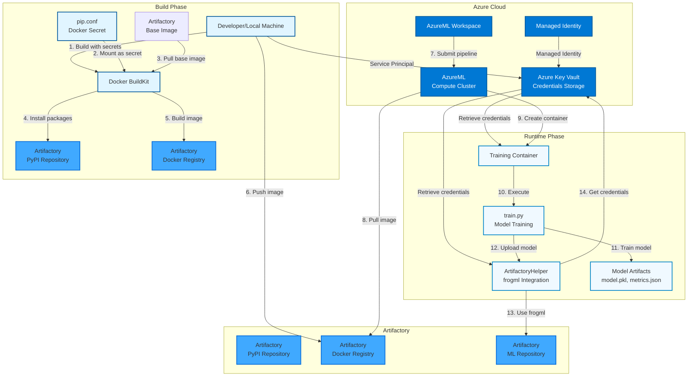
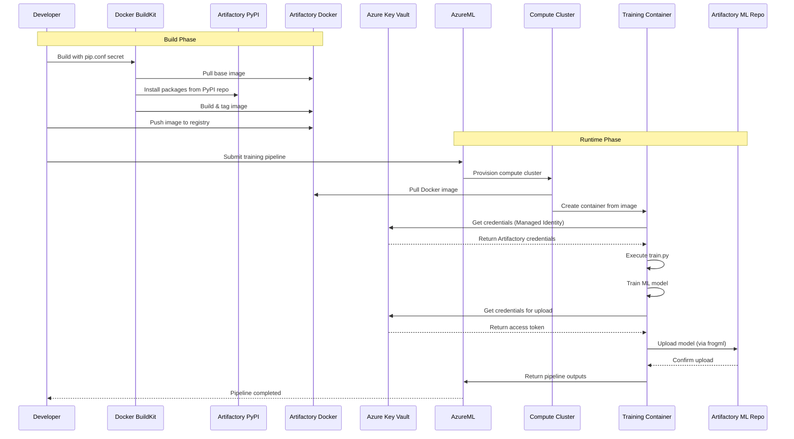

# AzureML + JFrog Artifactory Integration (WIP)

This project demonstrates integration between Azure Machine Learning (AzureML) and JFrog Artifactory for managing Python dependencies, Docker images, and AI model artifacts.

## Architecture

The following diagram illustrates the complete architecture and data flow of the system:



### Architecture Components

#### Build Phase
1. **Docker Build Process:**
   - Uses Artifactory base image (`python:3.11-slim` from Artifactory Docker registry)
   - Mounts `pip.conf` as Docker secret (secure credential handling)
   - Installs Python packages from Artifactory PyPI repository during build
   - Creates multi-stage Docker image with optimized layers

2. **Image Push:**
   - Built image is tagged and pushed to Artifactory Docker registry
   - Image is ready for use in AzureML pipelines

#### Runtime Phase
1. **AzureML Pipeline Execution:**
   - Pipeline pulls Docker image from Artifactory Docker registry
   - AzureML compute cluster creates container from the image
   - Container executes training script (`train.py`)

2. **Model Training & Upload:**
   - Training script trains ML model (Iris classifier)
   - Model artifacts are generated (model.pkl, metrics.json, metadata.json)
   - `ArtifactoryHelper` class retrieves credentials from Azure Key Vault
   - Model is uploaded to Artifactory ML Repository using `frogml` package

#### Authentication & Security
1. **Azure Key Vault:**
   - Stores all Artifactory credentials securely
   - Supports multiple authentication methods:
     - Username/Password
     - API Key
     - Access Token (preferred for frogml)

2. **Authentication Methods:**
   - **Local Development:** Uses Service Principal (Client ID/Secret)
   - **AzureML Runtime:** Uses Managed Identity (automatic, no credentials needed)
   - **Docker Build:** Uses Docker secrets (credentials not stored in image)

#### Data Flow
1. **Build Time:**
   - Base image → Artifactory Docker Registry
   - Python packages → Artifactory PyPI Repository
   - Credentials → Docker secrets (not stored in image)

2. **Runtime:**
   - Docker image → Artifactory Docker Registry → AzureML Compute
   - Credentials → Azure Key Vault → Container (via Managed Identity)
   - Trained model → Artifactory ML Repository (via frogml)

### Key Integration Points

- **Docker Images:** Pulled from Artifactory Docker registry during pipeline execution
- **Python Packages:** Installed from Artifactory PyPI repository during Docker build
- **ML Models:** Uploaded to Artifactory ML Repository using frogml SDK
- **Credentials:** Retrieved from Azure Key Vault using Managed Identity or Service Principal

### Sequence Diagram

The following sequence diagram shows the temporal flow of operations:



### Component Details

#### Docker Build Process
- **Multi-stage build** for optimized image size
- **Docker secrets** for secure credential passing (pip.conf)
- **Artifactory base image** from Docker registry
- **Package installation** from Artifactory PyPI during build

#### AzureML Pipeline
- **Environment:** Custom Docker image from Artifactory
- **Compute:** AzureML compute cluster with Managed Identity
- **Outputs:** Model files, metrics, and metadata
- **Authentication:** Automatic via Managed Identity

#### Artifactory Integration
- **Docker Registry:** Stores and serves Docker images
- **PyPI Repository:** Proxies Python packages
- **ML Repository:** Stores trained ML models with versioning
- **Authentication:** Multiple methods supported (token preferred)

#### Security Model
- **Build Time:** Docker secrets (credentials not in image layers)
- **Runtime:** Azure Key Vault + Managed Identity (no hardcoded secrets)
- **Network:** All communications over HTTPS
- **Access Control:** Role-based access via Azure and Artifactory

### Text-Based Architecture Overview

For environments where Mermaid diagrams don't render, here's a text-based representation:

```
┌─────────────────────────────────────────────────────────────────┐
│                        BUILD PHASE                               │
└─────────────────────────────────────────────────────────────────┘

Developer Machine
    │
    ├─► Docker BuildKit
    │       │
    │       ├─► Pull Base Image ──────────┐
    │       │                              │
    │       ├─► Mount pip.conf (secret)   │
    │       │                              │
    │       └─► Install packages ──────────┼─► Artifactory PyPI
    │                                      │
    └─► Push Image ────────────────────────┼─► Artifactory Docker Registry
                                           │
                                           │
┌─────────────────────────────────────────────────────────────────┐
│                       RUNTIME PHASE                              │
└─────────────────────────────────────────────────────────────────┘

AzureML Workspace
    │
    ├─► Submit Pipeline
    │       │
    │       └─► Compute Cluster
    │               │
    │               ├─► Pull Image ────────┐
    │               │                       │
    │               └─► Create Container   │
    │                       │              │
    │                       ├─► Get Credentials ──┐
    │                       │                      │
    │                       ├─► Execute train.py  │
    │                       │       │              │
    │                       │       ├─► Train Model
    │                       │       │
    │                       │       └─► Upload Model ──┐
    │                       │                           │
    │                       └───────────────────────────┼─► Artifactory ML Repository
    │                                                   │
    └───────────────────────────────────────────────────┘

┌─────────────────────────────────────────────────────────────────┐
│                    AUTHENTICATION FLOW                           │
└─────────────────────────────────────────────────────────────────┘

Azure Key Vault (Credentials Storage)
    │
    ├─► Artifactory Username
    ├─► Artifactory Password
    ├─► Artifactory Access Token (preferred)
    └─► Artifactory API Key (optional)

    Access Methods:
    • Local Dev: Service Principal (Client ID/Secret)
    • AzureML: Managed Identity (automatic)
    • Docker Build: Docker Secrets (not stored in image)
```

## Quick Start

### 1. Set Up Environment Variables

Source the environment setup script to configure Artifactory and Azure credentials:

```bash
source setup_env.sh
```

This script sets the following environment variables:
- `ARTIFACTORY_USERNAME` - Artifactory username
- `ARTIFACTORY_PASSWORD` - Artifactory password/access token
- `ARTIFACTORY_HOST` - Artifactory hostname
- `ARTIFACTORY_PYPI_REPO` - PyPI repository name
- `ARTIFACTORY_DOCKER_REPO` - Docker repository name
- `AZURE_KEY_VAULT_NAME` - Azure Key Vault name
- `AZURE_CLIENT_ID` - Azure service principal client ID
- `AZURE_CLIENT_SECRET` - Azure service principal secret
- `AZURE_TENANT_ID` - Azure tenant ID

### 2. Build Docker Image

Build the Docker image with the specified tag. The build uses Docker secrets for secure pip configuration:

```bash
TAG=5.0

docker build \
  --platform linux/amd64 \
  -t azureml-training:${TAG} \
  -f docker/Dockerfile \
  --secret id=pipconfig,src=pip.conf \
  --build-arg ARTIFACTORY_DOCKER_REGISTRY="${ARTIFACTORY_HOST}" \
  --build-arg ARTIFACTORY_DOCKER_REPO="${ARTIFACTORY_DOCKER_REPO}" \
  .
```

**Note:** Ensure Docker BuildKit is enabled for secret support:
```bash
export DOCKER_BUILDKIT=1
```

### 3. Tag and Push to Artifactory

Tag the image for Artifactory and push it to the registry:

```bash
docker tag azureml-training:${TAG} ${ARTIFACTORY_HOST}/${ARTIFACTORY_DOCKER_REPO}/azureml-training:${TAG}

docker push ${ARTIFACTORY_HOST}/${ARTIFACTORY_DOCKER_REPO}/azureml-training:${TAG}
```

Or using the hardcoded path:

```bash
docker tag azureml-training:${TAG} eldada.jfrog.io/azureml-docker-virtual/azureml-training:${TAG}

docker push eldada.jfrog.io/azureml-docker-virtual/azureml-training:${TAG}
```

### 4. Run Training Pipeline

Submit the training pipeline to AzureML:

```bash
python pipeline/training_pipeline.py
```

## Prerequisites

- Docker with BuildKit enabled
- Python 3.11+
- Azure CLI configured
- Access to Azure Key Vault
- JFrog Artifactory account with appropriate repositories

## Project Structure

```
.
├── docker/
│   └── Dockerfile          # Docker image configuration
├── pipeline/
│   └── training_pipeline.py # AzureML pipeline definition
├── src/
│   ├── train.py            # Model training script
│   └── utils/
│       └── artifactory_helper.py # Artifactory integration utilities
├── config/
│   └── config.yaml         # Configuration file
├── pip.conf                # Pip configuration for Artifactory
├── setup_env.sh            # Environment setup script
└── requirements.txt        # Python dependencies
```

## Configuration

### Pip Configuration

The `pip.conf` file contains Artifactory PyPI repository configuration with embedded credentials. This file is used as a Docker secret during build.

### Environment Setup

The `setup_env.sh` script contains environment variables for:
- Artifactory authentication
- Azure service principal credentials
- Repository names and endpoints

**Security Note:** Do not commit `setup_env.sh` or `pip.conf` with real credentials to version control. These files should be in `.gitignore`.

## Build Process

The Docker build process:

1. Uses Artifactory base image (if `ARTIFACTORY_DOCKER_REGISTRY` is provided)
2. Mounts `pip.conf` as a Docker secret for secure credential handling
3. Installs Python dependencies from Artifactory PyPI repository
4. Copies application code and sets up the environment

## Pipeline Execution

The training pipeline:

1. Pulls the Docker image from Artifactory
2. Trains the ML model
3. Uploads the trained model to Artifactory ML Repository
4. Verifies the upload was successful

## Troubleshooting

### Docker Build Issues

- Ensure BuildKit is enabled: `export DOCKER_BUILDKIT=1`
- Verify `pip.conf` exists and contains valid credentials
- Check that Artifactory Docker registry is accessible

### Pipeline Issues

- Verify Azure credentials are correctly set
- Check that the Docker image was successfully pushed to Artifactory
- Ensure Azure Key Vault has the required secrets

## License

See LICENSE file for details.
