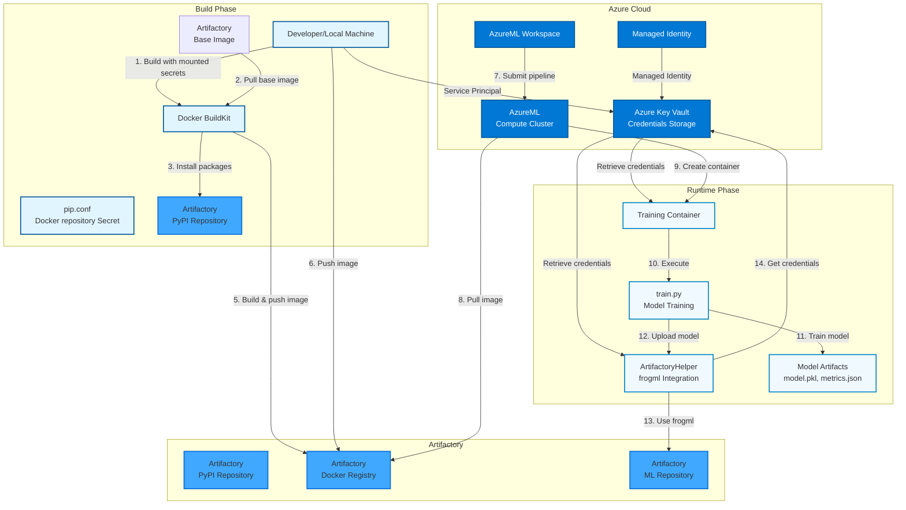
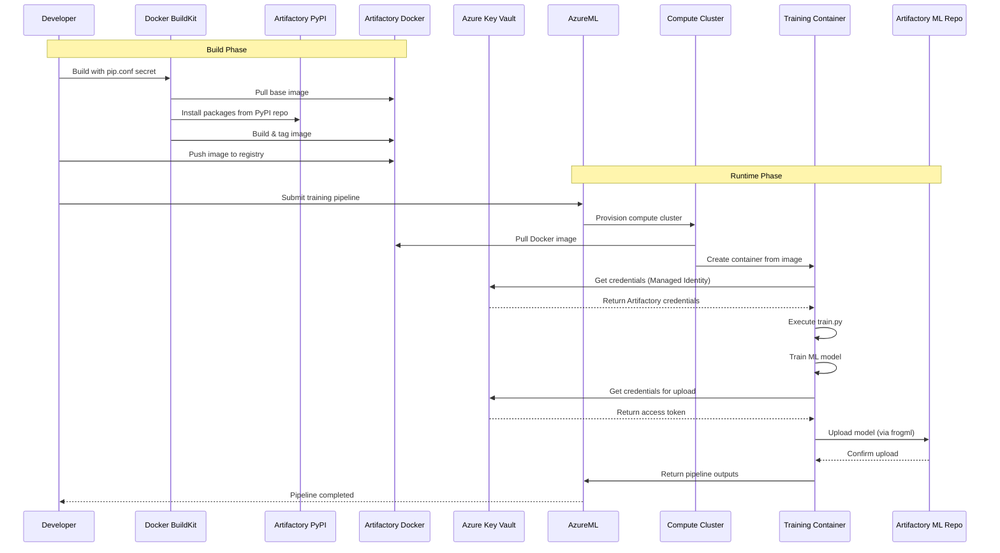

# AzureML + JFrog Artifactory Integration (WIP)

This project demonstrates how to build and run Azure Machine Learning (AzureML) jobs while sourcing packages, images, and model artifacts from/to JFrog Artifactory.
It focuses on secure credential handling, repeatable builds, and predictable promotion of trained models.

What’s inside:
- Opinionated Docker build that pulls base images and Python packages from Artifactory.
- AzureML training pipeline example that runs a sample training script producing a trained Iris model in a managed compute cluster (serverless)
- `frogml` JFrog SDK is used for working with Machine Learning models and datasets packages

## Architecture

The following diagram illustrates the complete architecture and data flow of the system:



### Architecture Components

#### Build Phase
1. **Docker Build Process:**
   - Uses Artifactory base image (`python:3.11-slim` from Artifactory Docker registry)
   - Mounts `pip.conf` as Docker secret (secure credential handling)
   - Installs Python packages from Artifactory PyPI repository during build
   - Creates multi-stage Docker image with optimized layers

2. **Image Push:**
   - Built image is tagged and pushed to Artifactory Docker registry
   - Image is ready for use in AzureML pipelines

#### Runtime Phase
1. **AzureML Pipeline Execution:**
   - Pipeline pulls Docker image from Artifactory Docker registry
   - AzureML compute cluster creates container from the image
   - Container executes training script (`train.py`)

2. **Model Training & Upload:**
   - Training script trains ML model (Iris classifier)
   - Model artifacts are generated (model.pkl, metrics.json, metadata.json)
   - `ArtifactoryHelper` class retrieves credentials from Azure Key Vault
   - Model is uploaded to Artifactory ML Repository using `frogml` package

#### Authentication & Security
1. **Azure Key Vault:**
   - Stores all Artifactory credentials securely
   - Supports multiple authentication methods:
     - Username/Password
     - API Key
     - Access Token (preferred for frogml)

2. **Authentication Methods:**
   - **Local Development:** Uses Service Principal (Client ID/Secret)
   - **AzureML Runtime:** Uses Managed Identity (automatic, no credentials needed)
   - **Docker Build:** Uses Docker secrets (credentials not stored in image)

#### Data Flow
1. **Build Time:**
   - Base image → Artifactory Docker Registry
   - Python packages → Artifactory PyPI Repository
   - Credentials → Docker secrets (not stored in image)

2. **Runtime:**
   - Docker image → Artifactory Docker Registry → AzureML Compute
   - Credentials → Azure Key Vault → Container (via Managed Identity)
   - Trained model → Artifactory ML Repository (via frogml)

### Key Integration Points

- **Docker Images:** Pulled from Artifactory Docker registry during pipeline execution
- **Python Packages:** Installed from Artifactory PyPI repository during Docker build
- **ML Models:** Uploaded to Artifactory ML Repository using frogml SDK
- **Credentials:** Retrieved from Azure Key Vault using Managed Identity or Service Principal

### Sequence Diagram

The following sequence diagram shows the temporal flow of operations:



### Component Details

#### Docker Build Process
- **Multi-stage build** for optimized image size
- **Docker secrets** for secure credential passing (pip.conf)
- **Artifactory base image** from Docker registry
- **Package installation** from Artifactory PyPI during build

#### AzureML Pipeline
- **Environment:** Custom Docker image from Artifactory
- **Compute:** AzureML compute cluster with Managed Identity
- **Outputs:** Model files, metrics, and metadata
- **Authentication:** Automatic via Managed Identity

#### Artifactory Integration
- **Docker Registry:** Stores and serves Docker images
- **PyPI Repository:** Proxies Python packages
- **ML Repository:** Stores trained ML models with versioning
- **Authentication:** Multiple methods supported (token preferred)

#### Security Model
- **Build Time:** Docker secrets (credentials not in image layers)
- **Runtime:** Azure Key Vault + Managed Identity (no hardcoded secrets)
- **Network:** All communications over HTTPS
- **Access Control:** Role-based access via Azure and Artifactory

### Text-Based Architecture Overview

For environments where Mermaid diagrams don't render, here's a text-based representation:

```
┌─────────────────────────────────────────────────────────────────┐
│                        BUILD PHASE                               │
└─────────────────────────────────────────────────────────────────┘

Developer Machine
    │
    ├─► Docker BuildKit
    │       │
    │       ├─► Pull Base Image ──────────┐
    │       │                              │
    │       ├─► Mount pip.conf (secret)   │
    │       │                              │
    │       └─► Install packages ──────────┼─► Artifactory PyPI
    │                                      │
    └─► Push Image ────────────────────────┼─► Artifactory Docker Registry
                                           │
                                           │
┌─────────────────────────────────────────────────────────────────┐
│                       RUNTIME PHASE                              │
└─────────────────────────────────────────────────────────────────┘

AzureML Workspace
    │
    ├─► Submit Pipeline
    │       │
    │       └─► Compute Cluster
    │               │
    │               ├─► Pull Image ────────┐
    │               │                       │
    │               └─► Create Container   │
    │                       │              │
    │                       ├─► Get Credentials ──┐
    │                       │                      │
    │                       ├─► Execute train.py  │
    │                       │       │              │
    │                       │       ├─► Train Model
    │                       │       │
    │                       │       └─► Upload Model ──┐
    │                       │                           │
    │                       └───────────────────────────┼─► Artifactory ML Repository
    │                                                   │
    └───────────────────────────────────────────────────┘

┌─────────────────────────────────────────────────────────────────┐
│                    AUTHENTICATION FLOW                           │
└─────────────────────────────────────────────────────────────────┘

Azure Key Vault (Credentials Storage)
    │
    ├─► Artifactory Username
    ├─► Artifactory Password
    ├─► Artifactory Access Token (preferred)
    └─► Artifactory API Key (optional)

    Access Methods:
    • Local Dev: Service Principal (Client ID/Secret)
    • AzureML: Managed Identity (automatic)
    • Docker Build: Docker Secrets (not stored in image)
```

## Quick Start


### Intiliaze Setup Environment (R&R: Azure Administrator)
### Prerequisites
* AzureML Workspace (R&R: Azure Administrator)
* In the Azure Machine Learning workspace Resource add Contributor (TODO add the least privlages to enable working with ws) role to the relevant users or Identities.
### Set Up
* Create Manage Identity and assign it with "Key Vault Secrets User" role for the Workaspace's Key-Vault:
    1. In Azure Managed Identity, create a new managed identity and name it. make sure to choose the AzureML workspace Resource Group and Region
    2. Return to the Azure ML Workspace and inside the overview page drill down to its key vault
    3. inside the Azure ML workspace key vault, open the Access control (IAM)
    4. Add role assignment to role "Key Vault Secrets User" for the managed identity you created above    
    5. Still inside the Workspace Keyvault entity Open > settings > Access Configuration settings and Make sure 'Azure role-based access control (recommended)' is selected

### JFrog Setup (R&R: JFrog Administrator or Project Admin)
### Prerequisites
* JFrog Pypi remote repository
* JFrog Docker Virtual, Local and Remote repositories
* JFrog Machine Learning Repository

### Configure training (R&R: ML Engineer)
### Prerequisites
* Python >= 3.11
* Create pip.conf pointing to you JFrog platform. (See pip.example.conf for referance)
* Azure CLI configured
* Login to Azure account. e.g.`az login --tenant <Tenant id>`, or any othe preferd method.
* Ensure Docker BuildKit is enabled for secret support: `export DOCKER_BUILDKIT=1`

### 1. Set Up Python virtual environment
```bash
cd <project directory>
export PIP_CONFIG_FILE=<pip.conf file you want to use>
source setup_venv.sh
```

### 2. Build, Tag and Push Docker Image
This step builts the training image, you can use the example as-is or replace its training logic on `src/train.py` script.

Build the Docker image with the specified tag. The build uses Docker secrets for secure pip configuration:


```bash
export ARTIFACTORY_HOST=PLACEHOLDER, i.e. <my jfrog platform host> without http schema
export ARTIFACTORY_DOCKER_REPO=PLACEHOLDER i.e. local/virtual repository name
TAG=<DOCKER_TAG>
docker login ${ARTIFACTORY_HOST}

# Use Artifactory base image (if available)
docker build \
  --platform linux/amd64 \
  -t ${ARTIFACTORY_HOST}/${ARTIFACTORY_DOCKER_REPO}/azureml-training:${TAG} \
  -f docker/Dockerfile \
  --secret id=pipconfig,src=${PIP_CONFIG_FILE} \
  --build-arg BASE_IMAGE="${ARTIFACTORY_HOST}/${ARTIFACTORY_DOCKER_REPO}/python:3.11-slim" \
  --push \
  .
```

### 3. Run Training Pipeline
This step creats a new training job inside the AzureML workspace and runs it. the job uses the training docker container we built and pushed in the previous steps.

#TODO: Remove the arti user and access and add just the secret name that Aviv is rotate. The user and the token should be included in the same value as in AWS.

Clone config/config.example.yaml into config/config.yaml and update the missing 'PLACEHOLDER' values

Submit the training pipeline to AzureML:

```bash
    python pipeline/training_pipeline.py
```
Once the training pipeline completes you will get a URL for the Azure ML job it created, use that to open the training job and follow its progress.

## Troubleshooting

### Docker Build Issues

- Ensure BuildKit is enabled: `export DOCKER_BUILDKIT=1`
- Verify `pip.conf` exists and contains valid credentials
- Check that Artifactory Docker registry is accessible

### Pipeline Issues

- Verify Azure credentials are correctly set
- Check that the Docker image was successfully pushed to Artifactory
- Ensure Azure Key Vault has the required secrets

## License

See LICENSE file for details.
